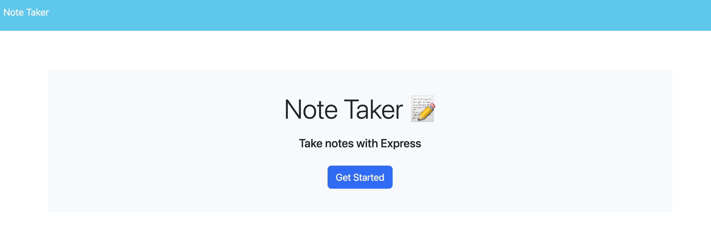
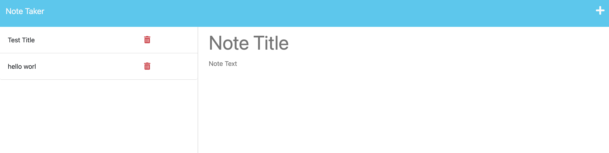

# Note_Taking

# Note Taker

## Bootcamp Week 11 Challenge

This week's challenge is to create a note taking application that uses Express.js on the back end and stores and retrieves data from a JSON file.

## Installation

This app requires Node.js, npm, Express.js, and Heroku.

## Usage

1. Click the "Get Started" link on the home page to get to the note taking page.
2. Enter a note title and descriptive text and hit the save icon in the upper-right hand corner.
3. After saving the note, it will appear in a list on the left-hand side.
4. If you are viewing an existing note in the main area, you can click the plus icon in the upper right hand corner to exit out of the note and add a new one.
5. To delete a note, click the trash can to the right of an existing note in the list.

## License

This product is licensed under MIT.

## Contributing

If you would like to contribute to this application, please refer to the [Contributor Covenant](https://www.contributor-covenant.org/).
